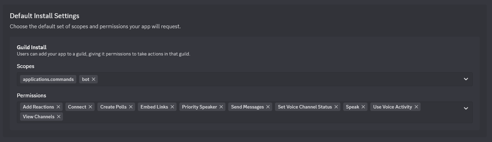

# discord-music

Another music bot for Discord with playback controls, song lyrics and advanced queue management.

**Libraries & APIs**:

- [NetCord](https://github.com/NetCordDev/NetCord): For Discord interaction.
- [FFmpeg](https://github.com/FFmpeg/FFmpeg): For audio processing.
- [yt-dlp](https://github.com/yt-dlp/yt-dlp): For YouTube audio extraction.
- [Deno](https://deno.com/): JavaScript runtime required by yt-dlp-ejs.
- [yt-dlp-ejs](https://github.com/yt-dlp/ejs): External JavaScript challenge solver scripts used by
  yt-dlp.
- [SpotifyApi-NET](https://github.com/JohnnyCrazy/SpotifyAPI-NET): For Spotify integration.
- [Genius](https://genius.com): For lyrics fetching.

> **Important**: This bot uses `yt-dlp` to fetch YouTube audio streams. Since YouTube may block IP
> ranges from cloud > providers, it's recommended to run the bot on a residential IP for reliable
> access. If you encounter the "confirm you're not a robot" error, your IP is likely blocked.
> A home network should work smoothly.

## Features

This bot is pretty minimal and intended for a single server only.

### **Music Functions**

- **Join & Leave**: Auto-connect and disconnect from voice channels.
- **Play Music**:
    - Stream audio from YouTube (URLs or search queries).
    - Play from Spotify (search on Spotify and stream via YouTube).
- **Playback Control**: Pause, resume, and seek to specific timestamps.

### **Queue Management**

- **Queue System**:
    - Add, remove, clear, and skip tracks.

### **Extra Features**

- **Lyrics Fetching**: Fetch lyrics for the currently playing song.
- **Audio Controls**: Interactive audio controls with buttons.
- **Audio Caching**: Cache tracks to reduce load times and enhance performance.
- **Auto Disconnect**: Automatically disconnect from the voice channel when empty.

### **Bot Management**

- **Docker Support**: Easily deploy the bot in a containerized environment.
- **Permission System**: Role-based access control for commands.

## Installation

### Discord Bot-Token

> **Important**: Keep your tokens secret. If exposed, regenerate them immediately.

To get a token, go to https://discord.com/developers/applications and add an application. Next, go
to the tab `Bot` and reset Token to get a new token. Add this token to your [.env](.env.example) (
docker) or [.dmrc](.dmrc.example) (manual). To invite the bot to your server
go to `Installation` tab and select `Scopes & Permissions` like in the image below.



Then copy the install-link, paste it into the browser, enter and select your server. You should now
see the bot offline as member of your server. After running the bot with your token, the status
should change to online.

### Docker / Podman (Recommended)

The `latest` tag is used for the newest version and has possibly not been in use for long. If you
want a better experience, use the `stable` tag.

To run the bot as a container, use the following commands:

```bash
docker pull ghcr.io/bycrookie/discord-music:latest
docker run -d --restart always --platform linux/amd64 --env-file .env --name dm -v /var/tmp/dm/data:/data ghcr.io/bycrookie/discord-music:stable
```

```bash
podman pull ghcr.io/bycrookie/discord-music:latest
podman run -d --restart always --platform linux/amd64 --env-file .env --name dm -v /var/tmp/dm/data:/data ghcr.io/bycrookie/discord-music:stable
```

A compose example can be found here [compose.yaml.example](compose.yaml.example).

Use the `--env-file` option to pass environment variables. An example `.env` file is
available here [.env.example](.env.example). The image does not contain a `.dmrc` config file.

For custom-builds, refer to the [Containerfile](Containerfile). The published image bundles the
latest nightly `yt-dlp`, patched `ffmpeg`, and the `deno` runtime so that YouTube extraction works
out of the box.

### Local Installation

**Supported Platforms**: `win-x64`, `linux-x64`, and `linux-arm64`. Other architectures may require
additional dependencies like `opus` and `libsodium`.

Make sure to specify a valid [cache location](#Cache).

#### Required Binaries and Libraries:

- **FFmpeg**: Use the static builds from the yt-dlp
  project: [yt-dlp/FFmpeg-Builds](https://github.com/yt-dlp/FFmpeg-Builds/releases). Choose the
  archive matching your
  architecture (e.g. `ffmpeg-master-latest-linux64-gpl.tar.xz` or
  `ffmpeg-master-latest-linuxarm64-gpl.tar.xz`) and
  extract `ffmpeg` and `ffprobe`.
- **yt-dlp**: Install from [yt-dlp releases](https://github.com/yt-dlp/yt-dlp/releases) (or nightly
  builds if desired).
- Add them to your system PATH or place them in the bot's directory.
- **Deno**: Install by following
  the [official instructions](https://docs.deno.com/runtime/getting_started/installation/) for your
  platform. Make sure the `deno` binary is available on the PATH or configure it via the
  `youtube.deno` setting described below.
- **yt-dlp-ejs scripts**: Allow yt-dlp to download the solver scripts by keeping the default
  `youtube.remoteComponents = ejs:github`, or install
  the [yt-dlp-ejs](https://pypi.org/project/yt-dlp-ejs/) package alongside yt-dlp if you manage the
  Python environment yourself.
- **Opus**: Install the Opus codec if not available. Download
  from [Opus Codec](https://opus-codec.org/) or build from
  source.
- **Libsodium**: Install from [Libsodium](https://libsodium.org/) if needed or build from source.

## Config

### Values

> **Note**: Avoid storing sensitive information in `.dmrc`. Use environment variables instead.

An example `.dmrc` file is available [here](.dmrc.example). When using container, pass everything
using environment variables An example `.env` file is available [here](.env.example).

The `[youtube]` section accepts `ffmpeg`, `ytdlp`, and `deno` entries. Each value can point to
either a binary file or a directory that contains the executable. Leave them empty to fall back to
the system `PATH`. Advanced yt-dlp switches can be configured via `jsRuntimes`, `remoteComponents`,
`noJsRuntimes`, and `noRemoteComponents`, mirroring the `--js-runtimes`/`--remote-components` flags.
By default, the bot enables the `deno` runtime and remote downloads for `ejs:github` so yt-dlp can
fetch the latest solver scripts automatically.

### Location

The bot first looks for the `.dmrc` INI file in the executable directory. If it’s not found, it
checks platform-specific paths. [XDG](https://specifications.freedesktop.org/basedir/latest/) is
supported. If no source matches, last location for context is used.

> Note: If multiple sources exist, values of higher priority sources override values of lower priority sources.

| Priority (top-down) | Path / Source                                                              | Context                                                       | 
|---------------------|----------------------------------------------------------------------------|---------------------------------------------------------------|
| 1                   | [Environment variable](#Environment-Variables) `DISCORD_MUSIC_CONFIG_FILE` | Manual override (highest priority)                            |
| 2                   | `./.dmrc`                                                                  | Portable mode (executable directory)                          |
| 3                   | `$XDG_CONFIG_HOME/bycrookie/discord-music/.dmrc`                           | [XDG](https://specifications.freedesktop.org/basedir/latest/) |
| 5                   | `$HOME/.config/bycrookie/discord-music/.dmrc`                              | Linux/MacOS fallback                                          |
| 5                   | `%APPDATA%/bycrookie/discord-music/.dmrc`                                  | Windows fallback                                              |

### Environment Variables

If a setting is missing from the `.dmrc` file, it will look for corresponding environment variables
prefixed with `DISCORD_MUSIC_`. For nested properties, use double underscores (`__`). Example:

```plaintext
DISCORD_MUSIC_DISCORD__TOKEN=your-token
DISCORD_MUSIC_DISCORD__ALLOW__0=music
```

### Cache

The cache location is determined pretty similar as the config file location.
[XDG](https://specifications.freedesktop.org/basedir/latest/) is supported. If no source matches,
last location for context is used.

| Priority (top-down) | Path / Source                                                                  | Context                                                       |
|---------------------|--------------------------------------------------------------------------------|---------------------------------------------------------------|
| 1                   | [Environment variable](#Environment-Variables) `DISCORD_MUSIC_CACHE__LOCATION` | Manual override (highest priority)                            |
| 2                   | `.dmrc`                                                                        | Value for cache location in config file                       |
| 3                   | `$XDG_CACHE_HOME/bycrookie/discord-music`                                      | [XDG](https://specifications.freedesktop.org/basedir/latest/) |
| 4                   | `$HOME/.cache/bycrookie/discord-music`                                         | Linux/MacOS fallback                                          |
| 5                   | `%LOCALAPPDATA%/bycrookie/discord-music/cache`                                 | Windows fallback                                              |

## Support

If you enjoy the bot, consider supporting the project by starring the repository and contributing to
its development through the following methods:

<a href="https://buymeacoffee.com/bycrookie" target="_blank"></a>

[:heart: Sponsor](https://github.com/sponsors/byCrookie)

## Development

For development, modify the [`.dmrc.ini`](src/DiscordMusic.Client/.dmrc.ini) file to test
configuration changes. Keep secrets
secure by using tools
like [dotnet user-secrets](https://learn.microsoft.com/en-us/aspnet/core/security/app-secrets).

```bash
dotnet user-secrets set --project ./src/DiscordMusic.Client/DiscordMusic.Client.csproj "discord:token" "your-discord-bot-token"
```
