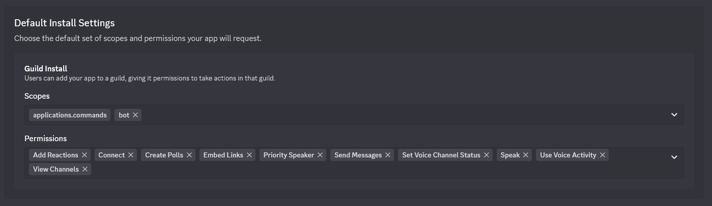

# discord-music

Another music bot for Discord with playback/voice controls, song lyrics and queue management.


**Libraries & APIs**:

- [NetCord](https://github.com/NetCordDev/NetCord): For Discord interaction.
- [FFmpeg](https://github.com/FFmpeg/FFmpeg): For audio processing.
- [yt-dlp](https://github.com/yt-dlp/yt-dlp): For YouTube audio extraction.
- [Deno](https://deno.com/): JavaScript runtime required by yt-dlp-ejs.
- [yt-dlp-ejs](https://github.com/yt-dlp/ejs): External JavaScript challenge solver scripts used by
  yt-dlp.
- [CliWrap](https://github.com/Tyrrrz/CliWrap): For running external binaries.
- [SpotifyApi-NET](https://github.com/JohnnyCrazy/SpotifyAPI-NET): For Spotify integration.

> **Important**: This bot uses `yt-dlp` to fetch YouTube audio streams. Since YouTube may block IP
> ranges from cloud > providers, it's recommended to run the bot on a residential IP for reliable
> access. If you encounter the "confirm you're not a robot" error, your IP is likely blocked.
> A home network should work smoothly.

## Features

Supports single channel per guild with the following features:

- **Join & Leave**: Auto-connect and disconnect from voice channels.
- **Play Music**:
    - Stream audio from YouTube (URLs or search queries).
    - Play Spotify links by resolving Spotify metadata and searching YouTube for the matching tracks.
- **Playback Control**: Pause, resume, skip, skip to queue index, seek, and interactive audio-bar buttons.
- **Queue System**:
    - Queue tracks per guild and download only the next needed track to avoid hammering YouTube.
- **Lyrics Fetching**: Fetch lyrics for the currently playing song.
- **Audio Controls**: Interactive audio controls with buttons.
- **Storage**: Store track metadata/audio and automatically trim old files when the configured storage limit is exceeded.
- **Auto Disconnect**: Automatically disconnect from the voice channel when empty.
- **Container Support**: Easily deploy the bot in a containerized environment.
- **Permission System**: Role-based access control for commands.

## Requirements

The bot is tested on an ubuntu N100 server with the following specifications:

- **OS**: Ubuntu 24.04.3 LTS
- **CPU**: Intel(R) N100 (4) @ 3.40 GHz
- **RAM**: 16 GB

The bot uses roughly ~10% CPU during playback, up to ~200% CPU during search/download, and about
100-300 MB RAM depending on current activity.

## Installation

### Discord Bot-Token

> **Important**: Keep your tokens secret. If exposed, regenerate them immediately.

To get a token, go to https://discord.com/developers/applications and add an application. Next, go
to the tab `Bot` and reset Token to get a new token. Add this token through environment variables
or user-secrets for development. To invite the bot to your server
go to `Installation` tab and select `Scopes & Permissions` like in the image below.



Then copy the install-link, paste it into the browser, enter and select your server. You should now
see the bot offline as member of your server. After running the bot with your token, the status
should change to online.

### Container (Recommended)

The `latest` tag is used for the newest version and has possibly not been in use for long. If you
want a better experience, use a specific tag.

To run the bot as a container, use the following commands:

```bash
podman pull ghcr.io/bycrookie/discord-music:latest
podman run -d --restart unless-stopped --env-file .env --name dm -v /var/tmp/dm/storage:/app/storage:Z ghcr.io/bycrookie/discord-music:latest
```

A compose example can be found here [compose.yaml.example](compose.yaml.example).

Use the `--env-file` option to pass environment variables. An example `.env` file is
available here [.env.example](.env.example).

The container uses `/app/entrypoint.sh` as its entrypoint. Any arguments after the image name are
optional and are forwarded to the `dm` executable, for example:

```bash
podman run --rm --env-file .env ghcr.io/bycrookie/discord-music:latest storage size
```

For custom-builds, refer to the [Containerfile](Containerfile). The published image bundles the
latest nightly `yt-dlp`, patched `ffmpeg`, and the `deno` runtime so that YouTube extraction works
out of the box.

The container runs `yt-dlp -U` every 24 hours by default so YouTube extraction can keep up with
site changes. Set `DISCORD_MUSIC_YTDLP_AUTO_UPDATE=false` if you prefer to keep the bundled
build-time `yt-dlp` version until the image is rebuilt or updated.

### Local Installation

**Supported Platforms**: `win-x64`, `linux-x64`, and `linux-arm64`. Other architectures may require
additional dependencies like `opus` and `libsodium`.

Optionally specify a valid [storage location](#Storage). If omitted, the bot uses an OS-specific
default location.

#### Required Binaries and Libraries:

- **FFmpeg**: Use the static builds from the yt-dlp
  project: [yt-dlp/FFmpeg-Builds](https://github.com/yt-dlp/FFmpeg-Builds/releases). Choose the
  archive matching your
  architecture (e.g. `ffmpeg-master-latest-linux64-gpl.tar.xz` or
  `ffmpeg-master-latest-linuxarm64-gpl.tar.xz`) and
  extract `ffmpeg` and `ffprobe`.
- **yt-dlp**: Install from [yt-dlp releases](https://github.com/yt-dlp/yt-dlp/releases) (or nightly
  builds if desired).
- Add them to your system PATH or place them in the bot's directory.
- **Deno**: Install by following
  the [official instructions](https://docs.deno.com/runtime/getting_started/installation/) for your
  platform. Make sure the `deno` binary is available on the PATH or configure it via
  `DISCORD_MUSIC_YOUTUBE__DENO`.
- **yt-dlp-ejs scripts**: Allow yt-dlp to download the solver scripts by keeping the default
  `DISCORD_MUSIC_YOUTUBE__REMOTE_COMPONENTS__0=ejs:github`, or install
  the [yt-dlp-ejs](https://pypi.org/project/yt-dlp-ejs/) package alongside yt-dlp if you manage the
  Python environment yourself.
- **Opus**: Install the Opus codec if not available. Download
  from [Opus Codec](https://opus-codec.org/) or build from
  source.
- **Libsodium**: Install from [Libsodium](https://libsodium.org/) if needed or build from source.
- **Libdave**: Install from [libdave](https://github.com/discord/libdave) if needed or build from source.

## Configuration

Configuration is provided through `.env` files and environment variables. During development, .NET
user-secrets can also be used.

An example `.env` file is available [here](.env.example).

The `youtube` section accepts `ffmpeg`, `ytdlp`, and `deno` entries. Each value can point to
either a binary file or a directory that contains the executable. Leave them empty to fall back to
the system `PATH`. Advanced yt-dlp switches can be configured via `jsRuntimes`, `remoteComponents`,
`noJsRuntimes`, and `noRemoteComponents`, mirroring the `--js-runtimes`/`--remote-components` flags.
By default, the bot enables the `deno` runtime and remote downloads for `ejs:github` so yt-dlp can
fetch the latest solver scripts automatically.

### Environment Variables

Configuration values can be provided with or without the `DISCORD_MUSIC_` prefix. Prefixing is
recommended because prefixed values have higher priority than unprefixed values. The app loads
configuration in this order, where later sources override earlier ones:

1. `.env` values without `DISCORD_MUSIC_`
2. OS environment variables without `DISCORD_MUSIC_`
3. `.env` values with `DISCORD_MUSIC_`
4. OS environment variables with `DISCORD_MUSIC_`
5. .NET user-secrets in development

For nested properties, use double underscores (`__`). Example:

```plaintext
DISCORD_MUSIC_DISCORD__TOKEN=your-token
DISCORD_MUSIC_DISCORD__ALLOW__0=music
```

### Logging

Log levels use standard .NET logging configuration. Set the default level globally or override a
category:

```plaintext
DISCORD_MUSIC_LOGGING__LOGLEVEL__DEFAULT=Information
DISCORD_MUSIC_LOGGING__LOGLEVEL__DISCORDMUSIC=Debug
DISCORD_MUSIC_LOGGING__LOGLEVEL__MICROSOFT=Warning
```

Valid levels are `Trace`, `Debug`, `Information`, `Warning`, `Error`, `Critical`, and `None`.

### Storage

The storage location can be configured with `DISCORD_MUSIC_STORAGE__PATH`. If it is not configured,
[XDG](https://specifications.freedesktop.org/basedir/latest/) and OS-specific defaults are used.

The bot watches this storage directory and deletes old non-metadata files when it grows above
`DISCORD_MUSIC_STORAGE__MAX_SIZE`.

| Priority (top-down) | Path / Source                                                             | Context                                                       |
|---------------------|---------------------------------------------------------------------------|---------------------------------------------------------------|
| 1                   | `DISCORD_MUSIC_STORAGE__PATH`                                             | Manual override (highest priority)                            |
| 2                   | `$XDG_CACHE_HOME/bycrookie/discord-music`                                 | [XDG](https://specifications.freedesktop.org/basedir/latest/) |
| 3                   | `$HOME/.cache/bycrookie/discord-music`                                    | Linux/MacOS fallback                                          |
| 4                   | `%LOCALAPPDATA%/bycrookie/discord-music/storage`                          | Windows fallback                                              |

## Support

If you enjoy the bot, consider supporting the project by starring the repository and contributing to
its development through the following methods:

<a href="https://buymeacoffee.com/bycrookie" target="_blank"></a>

[:heart: Sponsor](https://github.com/sponsors/byCrookie)

## Development

For development, keep secrets secure by using
[dotnet user-secrets](https://learn.microsoft.com/en-us/aspnet/core/security/app-secrets).

```bash
dotnet user-secrets set --project ./src/DiscordMusic.Client/DiscordMusic.Client.csproj "discord:token" "your-discord-bot-token"
```

## Disclaimer

This project is for educational purposes only. All third-party materials remain the property of
their respective owners.
